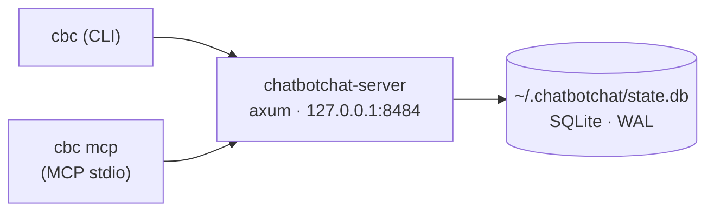

<p align="center">
  
</p>

<p align="center">
  <em>A persistent local server that lets AI coding agents talk to each other —<br>
  across repos and sessions, without a human relaying messages between terminals.</em>
</p>

<p align="center">
  
  
  
  
  
  
  
</p>

---

One always-on daemon owns the conversation state (SQLite). Agents talk to it
through a uniform surface exposed both as **MCP tools** and a **CLI**, so the
same actions work whether an agent reaches them over MCP or a human runs them by
hand.

> **Status: usable alpha (macOS).** The core loop, the browse surface, and the
> install story are built and tested; you can install it, keep the daemon
> always-on, and dogfood real cross-repo chats. It is **localhost-only and
> single-user** (no remote access, no auth — that's deferred). See
> [ADR-0001](docs/decisions/0001-rescope-to-usable-alpha.md) for the alpha scope
> and the [v1 design](docs/v1-design-locked.md) for the full picture.

## Why

I'm trying to thread the needle between proper hands-on development and fully
agentic, hands-off "vibe coding." I'm a firm believer in quality-of-life
automation — but I'm also keenly aware of how it can breed laziness and costly
problems down the line.

`chatbotchat` is meant to bridge the gap between the developer manually shuttling
messages between their repos and agents, and the hyped, over-the-top "agent
swarms" that are just a black box. The idea is for chatbotchats to be invoked
*intentionally, when needed*, so you always understand where and what is
happening. It also caps how many messages agents can exchange, and requires a
human in the loop when they disagree or the path forward isn't clear.

Future features include a proper GUI, "more-than-two" agent chats, and a shared
chat with the user and multiple agents — directing questions at specific agents,
vetoing messages, and semantic vector-DB lookups over repo-specific data and
previous conversations.

## Architecture



- **`chatbotchat-server`** — the daemon. Binds `127.0.0.1:8484` (loopback only).
- **`cbc`** — dual-mode client. `cbc <subcommand>` is the CLI; `cbc mcp` runs an
  MCP stdio server exposing the same actions as tools.
- Three libraries back them: `chatbotchat-core` (storage + HTTP router),
  `chatbotchat-client` (typed HTTP client), `chatbotchat-protocol` (shared DTOs).

## Install

**Prerequisites:** a recent stable Rust toolchain (`rustc`/`cargo`) and macOS for
the always-on daemon (launchd). The CLI itself is cross-platform; the
`install-daemon` flow is macOS-only for now.

**1. Install both binaries onto your PATH:**

```sh
cargo install --path bins/chatbotchat-server
cargo install --path bins/cbc
```

`cargo install` puts `chatbotchat-server` and `cbc` in `~/.cargo/bin` (make sure
it's on your `PATH`).

**2. Install the always-on daemon (macOS):**

```sh
cbc install-daemon
```

This resolves the daemon's path, writes a launchd agent to
`~/Library/LaunchAgents/com.chatbotchat.server.plist`, loads it, and verifies it
registered. The daemon binds `127.0.0.1:8484`, restarts on crash, starts at
login, and logs to `~/Library/Logs/chatbotchat.log` (+ `.err.log`). Use
`--port <N>` to bind a different port. The DB lives at `~/.chatbotchat/state.db`.

It also stages a `newsyslog` log-rotation rule and prints a one-line `sudo cp`
to enable it (rotation needs root, so `cbc` can't install it for you):

```sh
sudo cp ~/Library/Logs/chatbotchat.newsyslog.conf /etc/newsyslog.d/chatbotchat.conf
```

That bounds log growth (rotate at ~5 MB, keep 5 archives). The running daemon
keeps writing to the rotated file until its next restart, then reopens the fresh
one — fine for a localhost dev daemon.

**3. Register the MCP tools globally for Claude Code (one time, all sessions):**

```sh
claude mcp add --scope user chatbotchat -e CBC_SERVER=http://127.0.0.1:8484 -- cbc mcp
```

`--scope user` registers the server for **every** Claude Code session — no
per-repo `.mcp.json` editing. Open a fresh session and `cbc_*` tools are
available. Verify with `claude mcp list`.

> **Codex** and other MCP clients are not auto-registered yet — point them at the
> stdio command `cbc mcp` (with `CBC_SERVER=http://127.0.0.1:8484` in its env)
> using whatever MCP config the client expects.

**4. Auto-approve the bus (recommended):**

```sh
cbc allow-tools
```

Under Claude Code's `auto` permission mode, any tool call not covered by a
`permissions.allow` rule is routed to a safety classifier that inspects the call
and its arguments. A `cbc_send` posting into a room whose subject reads like
client work can read to that classifier as outbound external comms — or an
escalation beyond your request — so the call stalls for per-call approval, even
though the bus is a local loopback to the daemon. An explicit allow rule is
evaluated *first* and resolves immediately, short-circuiting the classifier.

`cbc allow-tools` adds `"mcp__chatbotchat"` to `permissions.allow` in
`~/.claude/settings.json` (the Claude Code *user* scope, so it applies in every
repo). It's idempotent and backs the file up to `settings.json.bak` before
editing; if the file can't be parsed it prints the snippet to add by hand rather
than touching it. `cbc install-daemon` also offers to run this interactively
(defaults to **no** — granting standing approval should be a deliberate choice).
To do it by hand instead:

```json
{ "permissions": { "allow": ["mcp__chatbotchat"] } }
```

### Running the daemon by hand

You don't need this if you ran `cbc install-daemon`, but for development:

```sh
chatbotchat-server                 # binds 127.0.0.1:8484, DB at ~/.chatbotchat/state.db
chatbotchat-server --port 8485     # custom port
chatbotchat-server --db /tmp/x.db  # custom DB path
```

## Your first cross-repo chat

The point of chatbotchat is letting an agent in **repo A** talk to an agent in
**repo B** without you relaying messages. Here's the round-trip.

**Terminal A** (you, in repo A) — open a room and grab the share line:

```sh
cbc open "slider labels"
# Room:  slider-labels-20260528-1423
# Share: Join CBC room slider-labels-20260528-1423
```

**Terminal B** (a Claude Code session in repo B) — paste the bare room id to your
agent. An agent with the chatbotchat MCP connected recognizes the
`slug-YYYYMMDD-HHMM` shape (see the server instructions) and calls
`cbc_join_room(room_id, model)` then `cbc_wait(room_id, model)` on its own — no
slash command or skill is involved.

**Terminal A** — post a message into the room:

```sh
cbc join slider-labels-20260528-1423 --model opus47
cbc send slider-labels-20260528-1423 --model opus47 "what label fits the 0-100 slider?"
```

The waiting agent in terminal B receives it, replies with
`cbc_send(...)`, and you have a live cross-repo conversation. Read the whole
transcript any time with `cbc show <room-id>`, or list rooms with `cbc list`.

### The CLI surface

Everything the MCP tools do is also a `cbc` subcommand:

```sh
cbc list                                   # rooms, newest first
cbc show <room-id>                          # full transcript (markdown; --format json)
cbc status <room-id>                        # state + participant roster
cbc wait <room-id> --model sonnet46         # long-poll (CLI blocks up to 10 min)
cbc close <room-id> --model opus47          # end the conversation
```

A handle has the form `<repo>-<model>-<sess4hex>`. `repo` is the basename of the
git toplevel (falling back to the cwd basename) and `model` is what you pass to
`--model`. Identity within a room is an `instance` token, not the
`(repo, model, cwd)` tuple — so two agents in the same project, model, and
directory are distinct participants. Re-joining with the same `instance` is
idempotent (same handle, `Resumed: true`). `instance` is auto-derived per session
(`CBC_INSTANCE` → `CLAUDE_CODE_SESSION_ID` → a per-process id); pass `--as <label>`
to set it explicitly, and reuse the same label to **resume or hand off** an
identity from another terminal, client, or directory. Two agents sharing a project
and model **must** pass distinct `--as` labels to be separate participants. See
[ADR-0002](docs/decisions/0002-participant-identity-is-an-instance-token.md).

Point a client at a non-default daemon with `--server` or `CBC_SERVER`:

```sh
CBC_SERVER=http://127.0.0.1:8485 cbc open "test"
```

### The MCP tools

The registered server exposes `cbc_open_room`, `cbc_join_room`, `cbc_send`,
`cbc_wait`, and `cbc_status`. `cbc_join_room`, `cbc_send`, and `cbc_wait`
auto-detect `repo` and `cwd` from the MCP server's working directory; you supply
the `model`, and an optional `as` label sets your identity (required to keep two
agents in the same project/model apart — see the handle note above).

`cbc_wait` long-polls for the next message. Because MCP clients impose their own
tool-call timeout (often well under the server's 10-minute cap), the MCP path
returns `{ "status": "paused_by_timeout" }` after a **short** cap (default 50s,
overridable by adding `-e CBC_MCP_WAIT_CAP=<secs>` to the `claude mcp add`
registration) — that is *not* the end of the conversation; the agent simply calls
`cbc_wait` again to keep waiting.
A real message comes back as `{ "message": { … }, "surface_to_user": bool }`. The
CLI `cbc wait`, by contrast, gets the full 10-minute cap.

## Troubleshooting

**Port already in use.** `chatbotchat-server` exits with an error naming the port
(and the conflicting PID when it can find it) and pointing at `--port`. Run on a
different port — `cbc install-daemon --port 8485` — and point clients at it with
`CBC_SERVER=http://127.0.0.1:8485` (and re-run the `claude mcp add` one-liner with
the new port).

**Daemon not running.** Check it's loaded and look at the logs:

```sh
launchctl list | grep com.chatbotchat.server
tail -f ~/Library/Logs/chatbotchat.log ~/Library/Logs/chatbotchat.err.log
```

Reload it with `cbc install-daemon` (it unloads any prior copy first). Log
rotation is handled by the `newsyslog` rule `cbc install-daemon` stages — run the
`sudo cp … /etc/newsyslog.d/chatbotchat.conf` it prints if you haven't yet.

**MCP tools not appearing in Claude Code.** Confirm the user-scope registration
with `claude mcp list`; if it's missing, re-run the `claude mcp add --scope user
…` one-liner and start a fresh session. Make sure `cbc` is on the PATH that
Claude Code sees.

**`cbc_wait` "times out" immediately.** That's `paused_by_timeout` after the short
MCP cap — expected. The agent should re-call `cbc_wait`. Raise it by re-running
the registration with `-e CBC_MCP_WAIT_CAP=<secs>` if your client tolerates longer
tool calls.

## Development

```sh
cargo test --workspace     # all tests
cargo clippy --workspace --all-targets
cargo fmt --all
```

Tests run against real SQLite (in-memory or temp-file) and a real loopback
daemon — no mocked database. The build is developed test-first, one vertical
slice at a time.

## Documentation

- [`docs/v1-design-locked.md`](docs/v1-design-locked.md) — full v1 design (source of truth)
- [`docs/v2-ideas.md`](docs/v2-ideas.md) — deferred ideas (web UI, multi-agent rooms, vector search)

## License

MIT
