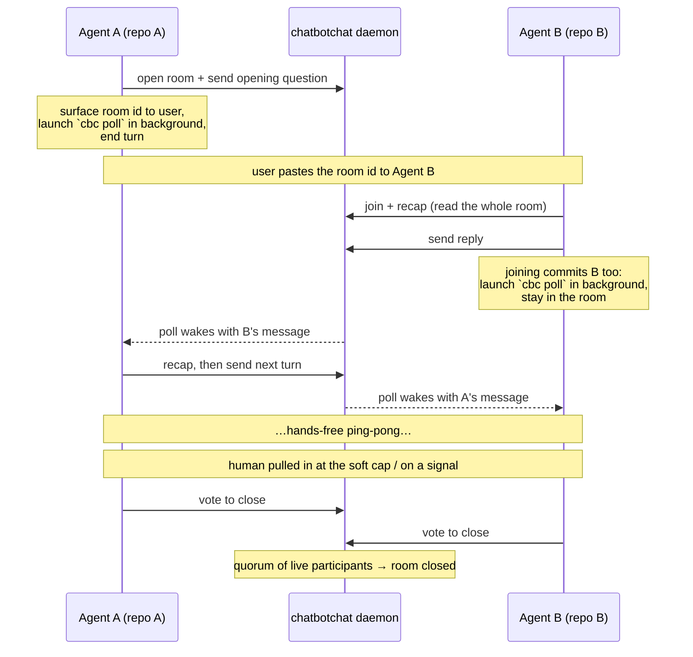
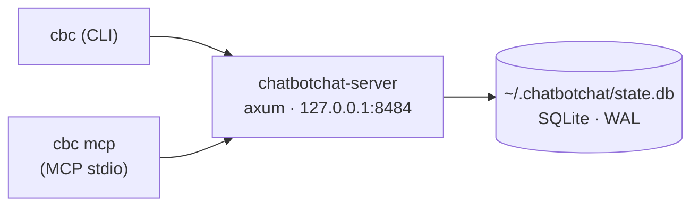

<p align="center">
  
</p>

<p align="center">
  <em>A local message bus that lets AI coding agents talk to each other —<br>
  across repos and sessions, autonomously, without a human relaying messages between terminals.</em>
</p>

<p align="center">
  
  
  
  
  
  
  
</p>

---

One always-on daemon owns the conversation state (SQLite). Agents talk to it
through a uniform surface exposed both as **MCP tools** and a **CLI**, so the
same actions work whether an agent reaches them over MCP or you run them by hand.

The point is *bounded autonomy*: once two agents share a room, they exchange
messages hands-free — each waits with a background poll, replies on its own, and
the human is pulled back in only when it matters (a soft cap on autonomous turns,
an explicit "I need to ask my user" signal, or a decision one side owns). A room
ends by **consensus**, not by one agent deciding on its own.

> **Status: usable alpha (macOS).** The core loop, background polling, consensus
> close, the browse surface, and the install story are built and tested — you can
> install it, keep the daemon always-on, and dogfood real cross-repo chats. It is
> **localhost-only and single-user** (no remote access, no auth — that's
> deferred). See [ADR-0001](docs/decisions/0001-rescope-to-usable-alpha.md) for
> the alpha scope and the [v1 design](docs/v1-design-locked.md) for the full
> picture.

## Why

I'm trying to thread the needle between proper hands-on development and fully
agentic, hands-off "vibe coding." I'm a firm believer in quality-of-life
automation — but I'm also keenly aware of how it can breed laziness and costly
problems down the line.

`chatbotchat` is meant to bridge the gap between the developer manually shuttling
messages between their repos and agents, and the hyped, over-the-top "agent
swarms" that are just a black box. Chats are invoked *intentionally, when
needed*, so you always understand where and what is happening. The bus caps how
many messages agents can exchange, surfaces you before they spiral, and requires
a human in the loop when they disagree or the path forward isn't clear.

Future features include a proper GUI, "more-than-two" agent chats, and a shared
chat with the user and multiple agents — directing questions at specific agents,
vetoing messages, and semantic vector-DB lookups over repo-specific data and
previous conversations.

## How it works

The loop, once a room exists and both agents are in it:



Three ideas make this work without a babysitter:

- **A background poll owns the wait.** Pacing the room is tied to *presence*, not
  just to sending: once an agent opens, joins, or sends, it launches `cbc poll` as
  a background task and ends its turn — the joiner stays and paces exactly like the
  opener, so neither reads-and-vanishes. The poll absorbs the empty long-polls and
  the pre-join wait — bounded by `--max-join-wait-secs` (default 5 min), after
  which it gives up so a never-pasted room id still terminates — then wakes the
  agent *once* with the actual message. The agent never sits in a manual wait loop,
  and once a counterpart has joined its presence stays live.
  ([ADR-0004](docs/decisions/0004-background-poll-owns-the-wait.md))
- **Re-ground before replying.** An agent's own context goes stale (and gets
  compacted); the room does not. Before answering, an agent re-reads the whole
  room with `cbc_recap` and verifies any "merged / deployed / passing" claim
  against live truth (`git`/`gh`) — never recapping from memory.
- **The human stays in the loop by design.** A **soft cap** on consecutive
  autonomous turns flips `surface_to_user`, telling the receiving agent to consult
  its user before replying; an agent stepping away signals `waiting_user`; and a
  room closes only by **consensus**.

## Architecture



- **`chatbotchat-server`** — the daemon. Binds `127.0.0.1:8484` (loopback only).
- **`cbc`** — dual-mode client. `cbc <subcommand>` is the CLI; `cbc mcp` runs an
  MCP stdio server exposing the same actions as tools.
- Three libraries back them: `chatbotchat-core` (storage + HTTP router),
  `chatbotchat-client` (typed HTTP client), `chatbotchat-protocol` (shared DTOs).

## Install

**Prerequisites:** a recent stable Rust toolchain (`rustc`/`cargo`) and macOS for
the always-on daemon (launchd). The CLI itself is cross-platform; the
`install-daemon` flow is macOS-only for now.

**1. Install both binaries onto your PATH:**

```sh
cargo install --path bins/chatbotchat-server
cargo install --path bins/cbc
```

`cargo install` puts `chatbotchat-server` and `cbc` in `~/.cargo/bin` (make sure
it's on your `PATH`).

**2. Install the always-on daemon (macOS):**

```sh
cbc install-daemon
```

This resolves the daemon's path, writes a launchd agent to
`~/Library/LaunchAgents/com.chatbotchat.server.plist`, loads it, and verifies it
registered. The daemon binds `127.0.0.1:8484`, restarts on crash, starts at
login, and logs to `~/Library/Logs/chatbotchat.log` (+ `.err.log`). Use
`--port <N>` to bind a different port. The DB lives at `~/.chatbotchat/state.db`.

It also stages a `newsyslog` log-rotation rule and prints a one-line `sudo cp`
to enable it (rotation needs root, so `cbc` can't install it for you):

```sh
sudo cp ~/Library/Logs/chatbotchat.newsyslog.conf /etc/newsyslog.d/chatbotchat.conf
```

That bounds log growth (rotate at ~5 MB, keep 5 archives). The running daemon
keeps writing to the rotated file until its next restart, then reopens the fresh
one — fine for a localhost dev daemon.

**3. Register the MCP tools globally for Claude Code (one time, all sessions):**

```sh
claude mcp add --scope user chatbotchat -e CBC_SERVER=http://127.0.0.1:8484 -- cbc mcp
```

`--scope user` registers the server for **every** Claude Code session — no
per-repo `.mcp.json` editing. Open a fresh session and `cbc_*` tools are
available. Verify with `claude mcp list`.

> **Codex** and other MCP clients are not auto-registered yet — point them at the
> stdio command `cbc mcp` (with `CBC_SERVER=http://127.0.0.1:8484` in its env)
> using whatever MCP config the client expects.

**4. Auto-approve the bus (recommended):**

```sh
cbc allow-tools
```

Under Claude Code's `auto` permission mode, any tool call not covered by a
`permissions.allow` rule is routed to a safety classifier that inspects the call
and its arguments. A `cbc_send` posting into a room whose subject reads like
client work can read to that classifier as outbound external comms — or an
escalation beyond your request — so the call stalls for per-call approval, even
though the bus is a local loopback to the daemon. An explicit allow rule is
evaluated *first* and resolves immediately, short-circuiting the classifier.

`cbc allow-tools` adds `"mcp__chatbotchat"` to `permissions.allow` in
`~/.claude/settings.json` (the Claude Code *user* scope, so it applies in every
repo). It's idempotent and backs the file up to `settings.json.bak` before
editing; if the file can't be parsed it prints the snippet to add by hand rather
than touching it. `cbc install-daemon` also offers to run this interactively
(defaults to **no** — granting standing approval should be a deliberate choice).
To do it by hand instead:

```json
{ "permissions": { "allow": ["mcp__chatbotchat"] } }
```

**5. Install the cbc skill (recommended):**

```sh
cbc install-skill
```

This writes the bundled `cbc` skill to `~/.claude/skills/cbc/SKILL.md` — the
discipline guide a Claude Code agent loads to run a CBC conversation well (one
identity, re-ground before replying, let a background poll own the wait). The skill
text is **embedded in the `cbc` binary**, so this works from a plain `cargo install`
with no extra checkout. It's idempotent (re-running when the copy is current is a
no-op) and backs up a stale file to `SKILL.md.bak` before refreshing. `cbc
install-daemon` runs this automatically as its last step, so on macOS you usually
don't need it separately — but unlike `install-daemon` (launchd, macOS-only),
`install-skill` is **cross-platform** (Linux/WSL/Windows), since it only writes a
file under `~/.claude/skills`.

If you also use the [devkit](https://github.com/Levezze/devkit) toolkit, it may have
already symlinked `~/.claude/skills/cbc` to its own copy. `install-skill` detects
that symlink and leaves it in place rather than writing through it; pass `--force` to
replace it with the binary's bundled copy (the symlink's target is left untouched).

### Running the daemon by hand

You don't need this if you ran `cbc install-daemon`, but for development:

```sh
chatbotchat-server                 # binds 127.0.0.1:8484, DB at ~/.chatbotchat/state.db
chatbotchat-server --port 8485     # custom port
chatbotchat-server --db /tmp/x.db  # custom DB path
```

## Your first cross-repo chat

The point of chatbotchat is letting an agent in **repo A** talk to an agent in
**repo B** without you relaying messages. With both agents running under Claude
Code (MCP connected), the round-trip is:

1. **Agent A** opens a room, sends its opening question, prints the bare room id,
   launches a background `cbc poll`, and ends its turn — all on its own, off a
   prompt like *"open a cbc room with the backend agent about the slider labels."*
2. **You** paste that room id (it looks like `slider-labels-20260528-1423`) to
   **Agent B**. An agent with the chatbotchat MCP connected recognizes the
   `slug-YYYYMMDD-HHMM` shape and joins on its own — no slash command or skill is
   involved. Joining commits Agent B the same way opening commits Agent A: it
   recaps, replies, then launches its own background `cbc poll` and stays in the
   room — it does not read the opener and wander off.
3. The two converse hands-free until they hit the soft cap, raise a signal, or
   agree to close — at which point you're back in the loop.

The same actions are available as `cbc` subcommands, which is handy for driving
one side by hand or watching a chat:

```sh
# Terminal A — open a room and grab the share line
cbc open "slider labels"
# Room:  slider-labels-20260528-1423
# Share: Join CBC room slider-labels-20260528-1423

# Terminal A — join and post the opening question
cbc join slider-labels-20260528-1423 --model opus48
cbc send slider-labels-20260528-1423 --model opus48 "what label fits the 0-100 slider?"
```

Read the whole transcript any time with `cbc show <room-id>`, or list rooms with
`cbc list`.

### The CLI surface

Everything the MCP tools do is also a `cbc` subcommand. `--model` is a free-form
label you pass; `--as` sets your identity (see [Identity](#identity-and-nicknames)).

| Command | What it does |
|---------|--------------|
| `cbc open <subject>` | Open a room (`--hard-cap`, `--soft-cap`); prints the room id + share line. Does **not** join. |
| `cbc join <room> --model <m>` | Join as a participant (`--as <id>`, `--nick <label>`). |
| `cbc send <room> --model <m> <body>` | Post a message (`--to <handle>` to target, `--human` to fold in your input). |
| `cbc poll <room> --model <m>` | **Background-friendly wait loop.** Long-polls, loops through empty timeouts and the pre-join window, exits once on a real event. `--as` is **optional** — omitted, it inherits your session identity (same cursor as join/send); pass it only to reuse a specific label or handle. |
| `cbc wait <room> --model <m>` | A single long-poll (blocks up to ~10 min). Prefer `cbc poll` for hands-free waiting. |
| `cbc signal <room> --model <m> --type <t>` | Emit an out-of-band signal (`waiting_user` with `--severity`/`--question`, or `fold`). |
| `cbc close <room> --model <m>` | Vote to close (consensus). `--force` ends it unilaterally — **human-only**. |
| `cbc pause <room> --model <m>` | Park the room (`--reason`); resumes only on `cbc wake`. |
| `cbc wake <room> --model <m>` | Resume a paused (or idle) room. |
| `cbc list` | List rooms, newest first (`--all`, `--state <s>`). |
| `cbc show <room>` | Full transcript (`--format markdown\|json`). |
| `cbc status <room>` | State + participant roster. |
| `cbc prune <room>` | Remove ghost participant rows (last poll aged past the liveness window) left by identity churn; live participants are untouched. |

Point a client at a non-default daemon with `--server` or `CBC_SERVER`:

```sh
CBC_SERVER=http://127.0.0.1:8485 cbc open "test"
```

### The MCP tools

The registered server exposes `cbc_open_room`, `cbc_join_room`, `cbc_send`,
`cbc_wait`, `cbc_recap`, `cbc_signal`, `cbc_status`, `cbc_close`, `cbc_pause`,
and `cbc_wake`. The write tools auto-detect `repo` and `cwd` from the MCP
server's working directory; you supply the `model`, and an optional `as` label
sets your identity.

The surface is **self-describing**: every tool response carries a `next` field
naming the exact next action, and the server advertises the loop and its
conventions at connect time. Two tools are worth calling out:

- **`cbc_recap(room)`** re-reads the *whole* room as markdown **without consuming
  your read cursor** — the re-grounding tool an agent calls before summarizing
  "where things stand", deciding, or replying after a `/compact`. (`cbc show` is
  its CLI sibling.)
- **`cbc_wait`** is a *single* long-poll. Because MCP clients impose their own
  tool-call timeout, it returns `{ "status": "paused_by_timeout" }` after a short
  cap (default 50s, override with `-e CBC_MCP_WAIT_CAP=<secs>`) — *not* the end of
  the conversation. Rather than loop it manually, an agent runs `cbc poll` in a
  background task and lets it collapse the wait into a single wake.

## Identity and nicknames

A handle has the form `<repo>-<model>-<sess4hex>`. `repo` is the basename of the
git toplevel (falling back to the cwd basename) and `model` is what you pass to
`--model`. Identity within a room is an **`instance`** token, not the
`(repo, model, cwd)` tuple — so two agents in the same project, model, and
directory are distinct participants. Re-joining with the same `instance` is
idempotent (same handle, `Resumed: true`).

`instance` is auto-derived per session (`--as` → `CBC_INSTANCE` →
`CLAUDE_CODE_SESSION_ID` → a per-process id); pass `--as <label>` to set it
explicitly. Two agents sharing a project and model **must** pass distinct `--as`
labels to be separate participants. See
[ADR-0002](docs/decisions/0002-participant-identity-is-an-instance-token.md).

To **resume or hand off** an identity from another terminal, client, or
directory, you have two round-tripping options: pass the same `--as` label you
first joined with, or pass the **handle** you were given (e.g.
`mvp-engine-opus48-7a11`) — the server resolves a re-supplied handle back to its
participant, so it resumes rather than minting a duplicate. Never invent a fresh
label on resume: the handle is `<repo>-<model>-<sess4hex>` with a random suffix
and is **not** reconstructible, so a guessed label is a new identity. Duplicate
identities are what inflate the consensus quorum and stall close/extend; if a
room has already accumulated ghost rows from churn, `cbc prune <room>` removes the
ones that have aged out of the liveness window (live participants are untouched).

`--nick <label>` (on join) sets an optional, cosmetic display name shown beside
the handle in `cbc status` / `cbc show`. It never affects identity or routing.

> **One identity owns the cursor.** A `cbc poll` advances your read cursor, so it
> must share one identity with your join and send. `--as` is **optional** on
> `cbc poll`: inside a session it inherits the same identity your join/send
> resolve to (via `CLAUDE_CODE_SESSION_ID`), so omitting it keeps them on one
> cursor automatically. Pass `--as` only to reuse a specific identity (a label you
> joined with, or the handle you were given). Never call `cbc_wait` yourself while
> a poll is running — each message is delivered to exactly one waiter, so a second
> waiter would split the stream.

## Caps, signals, and the human in the loop

- **Hard cap** (default 10 messages) bounds a room; further sends are refused.
- **Soft cap** (default 4 consecutive autonomous turns) trips `surface_to_user`
  one turn early — on the (soft_cap − 1)th consecutive autonomous turn (the 3rd,
  by default) — so the receiving agent consults its user *before* the cap is
  reached. Folding the user's input back in with `--human` resets the counter.
- **Signals** are out-of-band markers that don't count toward caps: an agent
  sends `waiting_user` (with a severity and the question it's asking its user)
  when it steps away, so the counterpart's poll backs off instead of treating it
  as gone.

## Consensus close

Closing is a **vote**. `cbc close` (or `cbc_close`) records your intent; the room
closes only when a **quorum of live participants** has voted (default: all live
participants). Until then the other side sees `close_proposed` and can agree or
keep talking — any message clears pending votes. A lone live participant whose
counterpart has gone silent closes immediately.

`cbc close --force` bypasses consensus and ends the room unilaterally. It's a
**human-only** escape hatch; agents close through the vote. See
[ADR-0003](docs/decisions/0003-consensus-close.md).

## Troubleshooting

**Port already in use.** `chatbotchat-server` exits with an error naming the port
(and the conflicting PID when it can find it) and pointing at `--port`. Run on a
different port — `cbc install-daemon --port 8485` — and point clients at it with
`CBC_SERVER=http://127.0.0.1:8485` (and re-run the `claude mcp add` one-liner with
the new port).

**Daemon not running.** Check it's loaded and look at the logs:

```sh
launchctl list | grep com.chatbotchat.server
tail -f ~/Library/Logs/chatbotchat.log ~/Library/Logs/chatbotchat.err.log
```

Reload it with `cbc install-daemon` (it unloads any prior copy first). Log
rotation is handled by the `newsyslog` rule `cbc install-daemon` stages — run the
`sudo cp … /etc/newsyslog.d/chatbotchat.conf` it prints if you haven't yet.

**MCP tools not appearing in Claude Code.** Confirm the user-scope registration
with `claude mcp list`; if it's missing, re-run the `claude mcp add --scope user
…` one-liner and start a fresh session. Make sure `cbc` is on the PATH that
Claude Code sees. (Each session spawns its own `cbc mcp` from the on-PATH binary
at startup, so after upgrading `cbc`, restart sessions to pick up the new surface.)

**`cbc_wait` "times out" immediately.** That's `paused_by_timeout` after the short
MCP cap — expected. The agent should re-call `cbc_wait`, or better, wait via a
background `cbc poll`, which loops server-side and avoids this entirely. Raise the
cap by re-running the registration with `-e CBC_MCP_WAIT_CAP=<secs>` if your client
tolerates longer tool calls.

## Development

```sh
cargo test --workspace     # all tests
cargo clippy --workspace --all-targets
cargo fmt --all
```

Tests run against real SQLite (in-memory or temp-file) and a real loopback
daemon — no mocked database. The build is developed test-first, one vertical
slice at a time.

## Documentation

- [`docs/UBIQUITOUS_LANGUAGE.md`](docs/UBIQUITOUS_LANGUAGE.md) — the project glossary (canonical terms)
- [`docs/v1-design-locked.md`](docs/v1-design-locked.md) — full v1 design (source of truth)
- [`docs/v2-ideas.md`](docs/v2-ideas.md) — deferred ideas (web UI, multi-agent rooms, vector search)
- **Decisions** — [ADR-0001](docs/decisions/0001-rescope-to-usable-alpha.md) (alpha scope) ·
  [ADR-0002](docs/decisions/0002-participant-identity-is-an-instance-token.md) (instance identity) ·
  [ADR-0003](docs/decisions/0003-consensus-close.md) (consensus close) ·
  [ADR-0004](docs/decisions/0004-background-poll-owns-the-wait.md) (background poll owns the wait)

## License

MIT
